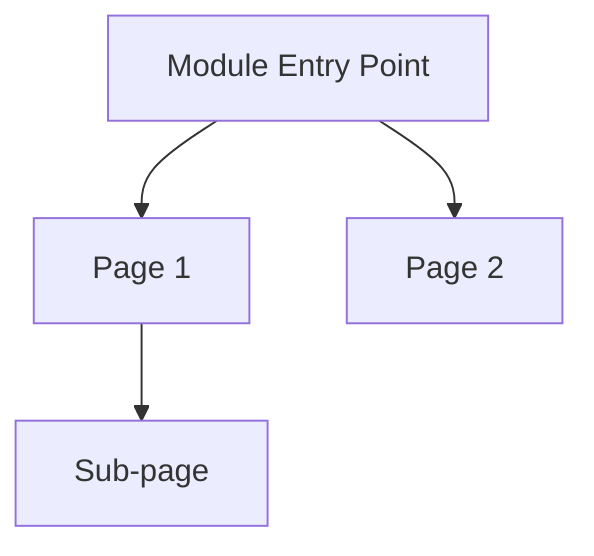

# Design Spec: [Module Name]

> **Source**: [OKX/Binance] iOS App
> **Analyzed**: [YYYY-MM-DD]
> **Flows Covered**: [list of flow folder names]
> **Screenshots Analyzed**: [count]

---

## 1. Information Architecture



---

## 2. Screen-by-Screen Analysis

### Screen [NNN]: [Screen Name]

**Purpose**: [One-line description]

**Layout Structure**:
- **Top zone** (status bar + nav): [description]
- **Content zone**: [description]
- **Bottom zone** (tab bar / actions): [description]

**Component Inventory**:

| Component | Type | Position | States | Notes |
|-----------|------|----------|--------|-------|
| [Name] | [Button/Input/Card/List/...] | [Top/Center/Bottom + Left/Right] | [Default/Active/Disabled/Error] | [Special notes] |

**Data Fields**:

| Field | Format | Update Frequency | Source |
|-------|--------|-----------------|--------|
| [Field name] | [Number/Text/Chart/...] | [Real-time/On-demand/Static] | [API/Local/Computed] |

**Interaction Behaviors**:
- Tap [element] → [action/destination]
- Swipe [direction] → [action]
- Long press [element] → [action]
- Pull down → [refresh behavior]

**Visual Design Notes**:
- [Color, typography, spacing, dark mode observations]

---

## 3. Reusable Component Library

| Component | Description | Used In (Screens) | Props/Variants | ZR Applicability |
|-----------|-------------|-------------------|----------------|------------------|
| [Name] | [What it does] | [Screen list] | [Key configurable properties] | [Direct use / Modify / Skip] |

---

## 4. Interaction Pattern Summary

### 4.1 Navigation Patterns
- [Pattern name]: [Description and where used]

### 4.2 Data Display Patterns
- [Pattern name]: [Description and where used]

### 4.3 Input & Form Patterns
- [Pattern name]: [Description and where used]

### 4.4 Feedback & Confirmation Patterns
- [Pattern name]: [Description and where used]

### 4.5 Gesture Patterns
- [Pattern name]: [Description and where used]

---

## 5. Design Strengths & Weaknesses

### Strengths (直接借鉴)
1. **[Pattern/Decision]**: [Why it works well] → **Recommendation**: Adopt directly
2. ...

### Weaknesses (改进机会)
1. **[Pattern/Decision]**: [What's wrong and why] → **Recommendation**: [How to improve]
2. ...

### Missing Features (创新机会)
1. **[Feature gap]**: [What's missing and why it matters for ZR]
2. ...

---

## 6. ZR Securities Adaptation Recommendations

### 6.1 Direct Adoption (直接采用)

| Pattern | Source | Rationale |
|---------|--------|-----------|
| [Pattern] | [OKX/Binance screen] | [Why keep as-is] |

### 6.2 Modification Required (需要调整)

| Pattern | Original | ZR Version | Rationale |
|---------|----------|------------|-----------|
| [Pattern] | [How competitor does it] | [How ZR should do it] | [Why change: multi-market/exchange/compliance] |

### 6.3 New Design Needed (需要新设计)

| Requirement | Why New | Design Direction |
|-------------|---------|-----------------|
| [ZR-specific need] | [No competitor reference] | [Suggested approach] |

### 6.4 Compliance Considerations (合规要求)

| SFC Requirement | Design Implication | Implementation |
|----------------|-------------------|----------------|
| [Regulation] | [How it affects this module] | [Suggested UI/UX approach] |

---

## 7. v0 Generation Hints

### Layout Blueprint
```
[ASCII or description of the key screen layout, precise enough for v0 prompt]
```

### Key Components for v0
- [Component 1]: [Exact description with dimensions, colors, behavior]
- [Component 2]: ...

### Interaction Specifications
- [Interaction 1]: [Trigger → Action → Feedback]
- ...

### Data Mock Requirements
- [What mock data v0 needs to render realistic previews]

---

*Generated by ZR Competitive Design Analysis Skill v1.0*
